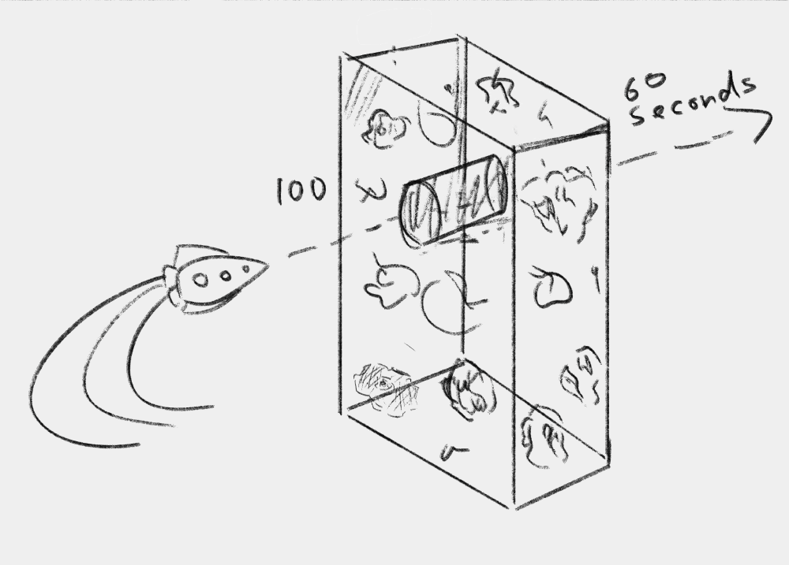

# Avoid the asteroids

You have successfully rescued the crew from the stricken ship, and are underway towards the nearest space station to drop off your new passengers. As the Captain starts the engines, you soon realise what happened to the Starship Titanic II. There is a large asteroid field surrounding you. A radar scan of the surroundings and you discover there are about 10000 asteroids between you and your destination! While your ship has a powerful enough radar to accurately pinpoint each of them, the navigation computer is overwhelmed and not able to plot a safe course through the field on its own. The Captain has asked if you can look at the data and find a safe direction for the ship.

Some important information about the upcoming asteroids:

* The asteroids occupy a space that is 100 x 100 units across (0 <= X <= 99 and 0 <= Y <= 99).
* You are unable to steer around them, you are going to have to go through the asteroid field.
* You will reach the asteroid field in exactly 1 hour (or 3600 seconds).
* Passing through will take 60 seconds.
* Each line of your input data represents an asteroid being tracked by your radar.
* Data for each asteroid consists of 4 values: Current X location, current Y location, horizontal speed, vertical speed of the asteroid (per second).
* If calculated locations for an asteroid at a given point in time contain a decimal, you can round down when determining what grid location is being occupied. For example if an asteroid is at x=54.8, that is occupying grid location 54. You should, however, retain the 0.8 when applying changes that adjust for time. If the same asteroid at 54.8 was moving at 0.5 units per second, in the next second it would be at x=55.3, meaning it was now occupying grid location 55.

The following in a pictorial representation of the upcoming asteroid field:



Find the X and Y coordinates that will be safe for your ship to pass through in exactly one hour, and that will remain safe for the 60 second transit time. Your answer is the coordinates in the form `X:Y`. For example if the safe location was X=13, Y=99, your answer would be `13:99`.

## Example

Consider if you were about to traverse a 8 by 8 region of space.

```
........
........
........
........
........
........
........
........
```

An asteroid with values `0 0 1 1` represents a starting X,Y location of 0,0 and a horizontal speed of 1 per second and a vertical speed of 1 per second. In an 8x8 region of space, at time=0, the region impacted by the asteroid would be:

```
X.......
........
........
........
........
........
........
........
```

At time=1 the total region impacted would now be:

```
X.......
.X......
........
........
........
........
........
........
```

And by time=4 the total region impacted would have been:

```
X.......
.X......
..X.....
...X....
....X...
........
........
........
```

## Example 2

This is a more complete example. The following data represents asteroid locations one hour prior to transit of an 8x8 region of space. This example works in the same way as the main problem. Coordinates given are for an hour prior to you passing through the region of space, and it will take you 60 seconds to transit the area so you need to find one region that will not be impacted by an asteroid in that 60 second time window.

```
-3600 -3600 1 1
-3601 -3600 1 1
3608 -3600 -1 1
3607 -3600 -1 1
3608 -3600 -1 1
-359 0 0.1 0
-359 1 0.1 0
-358 2 0.1 0
0 1830 0 -0.5
1 1830 0 -0.5
7 186 0 -0.05
185 7 -0.05 0
185 6 -0.05 0
6 -3600 0 1
2 4 0 0
5 7 0 0
7 6 0 0
```

Processing the above example would show that there is only one region of space that is safe for travel at x=5, y=4. In this case our answer would be `5:4`.

```
XXXXXXXX
XXXXXXXX
XXXXXXXX
XXXXXXXX
XXXXX.XX
XXXXXXXX
XXXXXXXX
XXXXXXXX
```

## Your task

Process the input data and find the safe location to travel in the range 0 <= X <= 99 and 0 <= Y <= 99. Remember to present your answer in the form of `X:Y`.
