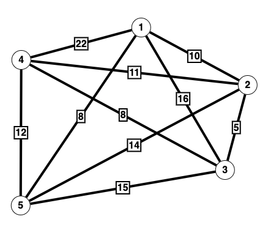

# Shopping expedition

You have docked at Tycho Station to offload the rescued crew from the Titanic II. The Captain has graciously decided to grant everyone shore-leave to relax before continuing on the journey to Earth. Time to go shopping!!! Wanting to make the most of the time available, you plot a map of all the shops that interest you on the station (your input data). To maximise your time at each shop, you want to determine the optimal (shortest) path that lets you travel from the Spaceport, visit every store, and then return to the Spaceport. Find the minimum distance required to travel to all the shops and return to your starting point.

## Example

Consider the following graph of shops where the location your ship is docked at is point 1, and points 2, 3, 4 and 5 are shops of interest to you. The lines between each point represent paths you can take with the distance of each path being the number on the line.




As input data this could be presented as a matrix like this.

```
00 10 15 20 08
10 00 05 11 14
15 05 00 08 15
20 11 08 00 12
08 14 15 12 00
```

To interpret this matrix, the first row and column both relate to point 1 (you'll notice the values are the same reading across and down). They represent the distances from point 1, to points 2,3,4 & 5 respectively. That is, the distance from point 1 to point 2 is 10 units, the distance from points 1 to 3 is 15 units, points 1 to 4 is 20 units, and points 1 to 5 is 8 units.

Given you need to start and stop at point 1, there are 4! (4 factorial) permutations possible for the sequence of visiting the other points. These are the different 24 different options available to you and the different travel distances each would involve.

```
1-2-3-4-5-1 43
1-2-3-5-4-1 62
1-2-4-3-5-1 52
1-2-4-5-3-1 63
1-2-5-3-4-1 67
1-2-5-4-3-1 59
1-3-2-4-5-1 51
1-3-2-5-4-1 66
1-3-4-2-5-1 56
1-3-4-5-2-1 59
1-3-5-2-4-1 75
1-3-5-4-2-1 63
1-4-2-3-5-1 59
1-4-2-5-3-1 75
1-4-3-2-5-1 55
1-4-3-5-2-1 67
1-4-5-2-3-1 66
1-4-5-3-2-1 62
1-5-2-3-4-1 55
1-5-2-4-3-1 56
1-5-3-2-4-1 59
1-5-3-4-2-1 52
1-5-4-2-3-1 51
1-5-4-3-2-1 43
```

Looking at the above, you can determine the shortest path would be `1-2-3-4-5-1` or `1-5-4-3-2-1` (being the same path in reverse) with a total travel distance of 43 units. In this example `43` would be your answer.

## Your task

Process your input data and determine the shortest distance you need to travel in order to visit every point once (and only once), starting from the first point, and finishing back at that same first point.