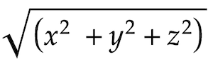

# Tour the stars

You walk into a travel agent at the markets. The alien at the counter greets you, "Welcome and may the fourth be with you!"

The travel agent is selling a "visit every moon" tour for all the moons in the local system. It sounds exciting! They even have a holographic 3 dimensional map of the moons hovering in the middle of the store. You are fascinated by this and make a record of the 3d coordinates of each stop in the tour. 

You are curious to know the total distance you would have to travel if you went on the tour, so you record all the coordinates in the order in which they will be visited. Using Pythagoras theorem in 3 dimensions, you know you can calculate the distance by finding the total of all the various hypotenuse distances between each pair of points.

## An example

Consider the following sets of 3d coordinates that represent a small tour.

```
0 0 0
-2 -3 14
5 13 -15
8 -6 5
0 0 0
```

The above data indicates that from your starting point, your first destination is at x y z coordinates (-2, -3, 14). To calculate the distance for this first leg of the journey, use Pythagoras theorem in 3 dimensions on the change for each plane as given by...



In this case it could be described as `squareroot( square(-2) + square(-3) + square(14) )` which is 14.457. To keep things simple, you truncate each segment to the integer portion, so 14.

The distance for each leg of the example trip is:

* `0, 0, 0` to `-2, -3, 14` is 14 units.
* `-2, -3, 14` to `5, 13, -15` is 33 units.
* `5, 13, -15` to `8, -6, 5` is 27 units.
* `8, -6, 5` to `0, 0, 0` is 11 units.

The total distance travelled in the example is 85 units.

## Your task

Process the coordinates of all the moons in the tour and calculate the total distance that would be travelled (remember to truncate each leg of the journey).
