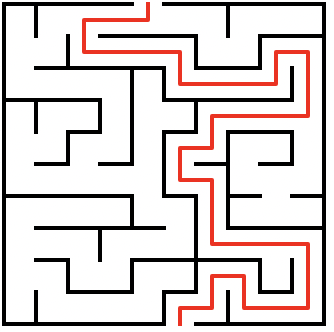

# Lost in an alien market!

You put your souvenirs away (you will see one tomorrow night 😉), and look at the time. You realise you need to start returning back to the ship!

Problem is you have been having a wonderful time exploring and have gotten lost! Fortunately there is a map nearby. Studying the map, you realise just how crazy these alien markets are - it is practically a maze! You are in the depths of the market and need to find the quickest way back to the ship.

Fortunately, being the intelligent computer scientist you are, you know that there are a number of algorithms that could help solve this such as a [breadth first search](https://en.wikipedia.org/wiki/Breadth-first_search). You use your phone to take a photo of the map and convert it into a format you are able to process (your input data). How many blocks must you travel to exit the alien market?

## An example

Your input data uses `#` symbols to indicate the walls of the alien market. You are currently at the top of the map, and need reach the bottom in order to exit.

An example set of input data might look like this:

```
######### ########### 
# #           #     # 
# # # ####### # ##### 
#   #       #   #   # 
# ######### ##### # # 
#       # #       # # 
####### # ######### # 
# #   # #   #       # 
# # ### # ### ##### # 
#   #   # #   #   # # 
# ### ### # ### ### # 
#         #   #     # 
######### ### ### ### 
#       #   # #     # 
# ######### # ####### 
#     #     #       # 
# ### # ######### # # 
#   #   #   #   # # # 
# # ##### ### # ### # 
# #       #   #     # 
########### ######### 
                      
```

Viewing this in graphical form, you can see the path to exit would be:



Tracing this path onto our data, using `.` to indicate the steps taken would be:

```
#########.########### 
# #  .....    #     # 
# # #.####### # ##### 
#   #.......#   #...# 
# #########.#####.#.# 
#       # #.......#.# 
####### # #########.# 
# #   # #   #.......# 
# # ### # ###.##### # 
#   #   # #...#   # # 
# ### ### #.### ### # 
#         #...#     # 
######### ###.### ### 
#       #   #.#     # 
# ######### #.####### 
#     #     #.......# 
# ### # ######### #.# 
#   #   #   #...# #.# 
# # ##### ###.#.###.# 
# #       #...#.....# 
###########.######### 
```

To find the answer, count the number of steps filled with `.`. In this example there are 71. 

## Your task

Use the input data to count the number of steps required to exit the markets.
 