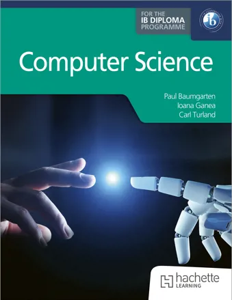
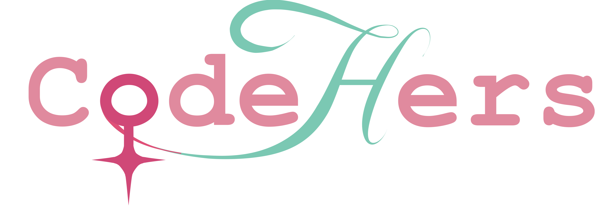

# Welcome

I am a Secondary Computer Science teacher, currently working at an international school in Hong Kong where I teach Computer Science through the IB Diploma, IGCSE and MYP. Previously I have also lived and worked in Lausanne Switzerland, and Perth Australia, which is where I was raised.

## Why learn Computer Science?

*Why learn Computer Science and programming?*

Computer Science is everywhere! It is the field that is changing society like no other. From transportation to agriculture, medicine to business finance, from entertainment to government – Computer Science is rapidly changing our business and personal lives. It does not matter if you wish to pursue Computer Science for a career, or if you are just exploring it while in school, a solid background in the fundamentals of Computer Science will be valuable no matter your final profession. 

Computer Science is more than programming, and programming is more than coding. In fact, "Coding is to programming what typing is to writing. If you learn to program by learning to code, you essentially only know how to type." - Dr Leslie Lamport (Turing Award winner and Computer Science luminary).

Ultimately, Computer Science is about solving problems. It includes the study of algorithms and the structure of data to help model the problems we are working on. Programming languages are a tool used to help express our solution. While this guide is focused only on the latter, it is important to remember the bigger picture as you proceed. 

## Current projects

### Published author for IB Diploma Computer Science

In collaboration with Carl Turland and Ioana Ganea, I have authored a book for the new IB Diploma Computer Science syllabus. Published by Hachette Learning (formerly Hodder Education).

The e-Inspection copy and pre-orders are now available.

* [Hachette Learning book link](https://www.hachettelearning.com/computing-and-it/computer-science-for-the-ib-diploma). 
* [Amazon book link](https://www.amazon.com/Computer-Science-Diploma-Paul-Baumgarten/dp/1036009009)

### CodeHers HK

Computer Science, as a subject and a profession, remains heavily male dominated. Code Hers is a collaboration of 11 International Schools within Hong Kong that aims to address this disparity by providing a safe, supporting and encouraging environment for girls to have a go. The ultimate aim is to normalise the presence of women in tech, making the need for such events obsolete. Until that day comes, however, events like Code Hers are critically important and serve an important role.

The inaugural event in 2024 attracted over 300 girls in attendance, and we are looking at bigger and better at our 2025 event on 15 March. 

* ⁠Website - [codehershk.org](https://codehershk.org/)
* Instagram - [@codehershk](https://instagram.com/codehershk) 
* ⁠Information letter for schools - [codehershk.org/marketing/2025intro-letter.pdf](https://codehershk.org/marketing/2025intro-letter.pdf)
* ⁠Promotional posters - [codehershk.org/marketing/2025poster.pdf](https://codehershk.org/marketing/2025poster.pdf)
* ⁠Promotional video - [youtube.com/watch?v=4yTva9Ncbrs](https://www.youtube.com/watch?v=4yTva9Ncbrs)

I made an [infographic](/assets/gender-equality-in-cs-why.png) that outlines the case for girls-only events in Computer Science.

### Coding Quest

Coding Quest is an annual competition specifically for secondary students to showcase their knowledge and understanding of algorithm design, data structures and computational thinking.

There are no prizes, just bragging rights. Coding Quest exists mostly for students to compete against themselves.

Coding Quest was a project I started during the Covid era, and it has gathered pace since. Last year over 100 schools had students participate!

* [codingquest.io](https://codingquest.io).

---

Computer Science is a fascinating industry of unending change and learning. There are so many exciting technologies emerging at the moment, it is a great time to learn CS no matter who you are!

Paul Baumgarten
January 2025
