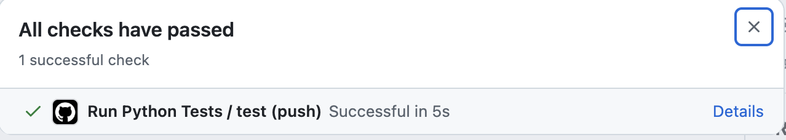
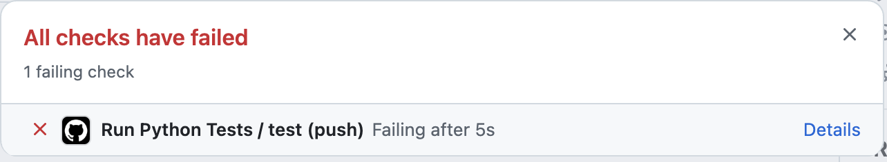

# B2 Programming
IB Diploma Computer Science

---

# Lesson 1: Hello world

---

## Today's agenda: Set up our tools

1. Install Thonny or VS Code - https://code.visualstudio.com/
2. Install Github Desktop - https://desktop.github.com/
3. Create a Github account - https://github.com/
4. Create a Github repo for your initial exercises (creating a dedicated folder as well)
5. Add me as a collaborator (user: `paulbaumgarten`)
6. Practice uploading to your Github repo

---

## Why Github?

* Practice using industry standard tooling
* Cloud-based storage. Think of it as Google Drive but for programming projects.
* Version Control. A history of all changes made to your code.
* Synchronisation with multiple computers.
* Automated tests. We can automatically run checks on the code you submit to see if it has solved the problems given.

---

## First exercise

Let's start with the classic...

```python
name = input("What is your name?")
print(f"Hello, {name}!")
```

Save as `exercise_01_hello.py`

---

## Add automated tests to your repo

* Obtain these two files from my [website](https://pbaumgarten.com/docs/ib-compsci-2027/b2.html#lesson-1-hello-world) and add to your repo:
  * `test_exercises.py`
  * `.github/workflows/python-tests.yml`
* Github Desktop: Push (upload) to Github
* Github Desktop: Repository / View on Github
* Check the status of the test...

---

## Checking test results

Did your tests pass?




---

# Lesson 2: Numeric types & operations

---

## Syllabus

B2.1.1 Construct and trace programs using a range of global and local variables of various data types.

* Data types: Boolean value, char, decimal, integer, string

---

# Lesson 3: String types & operations

---

## Syllabus

B2.1.2 Construct programs that can extract and manipulate substrings.

* Writing of programs that accurately identify and extract substrings from given strings, demonstrating the ability to perform various manipulations, such as altering, concatenating or replacing

---

# Lesson 4: Exception handling & debugging techniques

---

## Syllabus

B2.1.3 Describe how programs use common exception handling techniques.

* Potential points of failure in a program must include unexpected inputs, resource unavailability, logic errors.
* The role of exception handling in developing programs
* Exception handling constructs that effectively manage errors must include try/catch in Java, and try/except in Python, along with the finally block.

B2.1.4 Construct and use common debugging techniques.

* Debugging techniques may include trace tables, breakpoint debugging, print statements and step-by- step code execution.

---

# Lesson 5,6: Static & dynamic structures; Arrays & lists

---

## Syllabus

B2.2.1 Compare static and dynamic data structures.

* The fundamental differences between static and dynamic data structures, including their underlying mechanisms for memory allocation and resizing
* The advantages and disadvantages of each type in various scenarios, considering factors such as speed, memory usage, flexibility

B2.2.2 Construct programs that apply arrays and Lists.

* One-dimensional (1D) arrays, two-dimensional (2D) arrays, ArrayLists in Java
* One-dimensional (1D) Lists and two-dimensional (2D) Lists in Python
* Add, remove and traverse elements in a dynamic list

---

# Lesson 7: Stacks

---

## Syllabus

B2.2.3 Explain the concept of a stack as a “last in, first out” (LIFO) data structure.

* Must include fundamental operations such as push, pop, peek and isEmpty
* How stack operations impact both performance and memory usage
* An appropriate stack for a specific problem

---

# Lesson 8: Queues

---

## Syllabus

B2.2.4 Explain the concept of a queue as a “first in, first out” (FIFO) data structure.

* Must include fundamental operations such as enqueue, dequeue, front and isEmpty
* How queue operations impact both performance and memory usage
* An appropriate queue for a specific problem

---

# Lesson 9: Sequence & selection

---

## Syllabus

B2.3.1 Construct programs that implement the correct sequence of code instructions to meet program objectives.

* The impact of instruction order on program functionality
* Ways to avoid errors, such as infinite loops, deadlock, incorrect output

B2.3.2 Construct programs utilizing appropriate selection structures.

* Must include: if, else, else if (Java), elif (Python), to execute different code blocks based on specified conditions
* Selection structures with or without Boolean operators (AND, OR, NOT) and/or relational operators (<, <=, >, >=, ==, !=) to control program flow effectively

---

# Lesson 10,11: Iteration

---

## Syllabus

B2.3.3 Construct programs that utilize looping structures to perform repeated actions.

* Types of loops, including counted loops and conditional loops, and appropriate use of each type
* Conditional statements within loops, using Boolean and/or relational operators to govern the loop’s execution

---

# Lesson 12: Functions & modularisation

---

## Syllabus

B2.3.4 Construct functions and modularization.

* Functions to define reusable blocks of code with different inputs
* Modularization to create well-structured, reusable and maintainable code
* The principles of scope (local versus global)
* The benefits of code modularization, applying this concept to various programming scenarios

---

# Lesson 13: Big O

---

## Syllabus

B2.4.1 Describe the efficiency of specific algorithms by calculating their Big O notation to analyse their scalability.

* The time and space complexities of algorithms and calculating Big O notation
* Algorithm choice based on scalability and efficiency requirements

---

# Lesson 14,15: Search algorithms

---

## Syllabus

B2.4.2 Construct and trace algorithms to implement a linear search and a binary search for data retrieval.

* The differences in efficiency between different methods of linear and binary search
* Use of search technique based on efficiency requirements—for example, searching a database for a sorted/indexed list of names to find a phone number, versus searching by the number to identify the name

---

# Lesson 16,17: Sort algorithms

---

## Syllabus

B2.4.3 Construct and trace algorithms to implement bubble sort and selection sort, evaluating their time and space complexities.

* The time and space complexities of each algorithm, denoted by their respective Big O notations
* The advantages and disadvantages of each algorithm in terms of efficiency across various data sets

---

# Lesson 18,19,20: Recursion (HL)

---

## Syllabus

B2.4.4 Explain the fundamental concept of recursion and its applications in programming. (HL only)

* The fundamentals of recursion and its advantages and limitations
* The utility of recursion in solving problems that can be broken down into smaller, similar sub-problems
* Recursive algorithms, including but not limited to quicksort
* The limitations of recursion, including complexity and memory usage
* Situations that best suit the use of recursion, including fractal image creation, traversing binary trees, sorting algorithms

B2.4.5 Construct and trace recursive algorithms in a programming language. (HL only)

* Simple, non-branching recursive algorithms in programming only

---

# Lesson 21: File processing

---

## Syllabus

B2.5.1 Construct code to perform file-processing operations.

* Programs that manipulate text files
* Opening a sequential file in various modes (read, write, append)
* How to read from and write to files, append data to an existing file, and close a file once operations are completed
* Classes for Java users may include Scanner, FileWriter, BufferedReader.
* Functions for Python users may include open(), read(), readline(), write(), close().

---

# Lesson 22,23,24,25,26,27: Programming scenarios

---

## Syllabus

---

# Lesson 28,29: Review

---

## Syllabus

---

# Lesson 30: Assessment

---

## Syllabus

